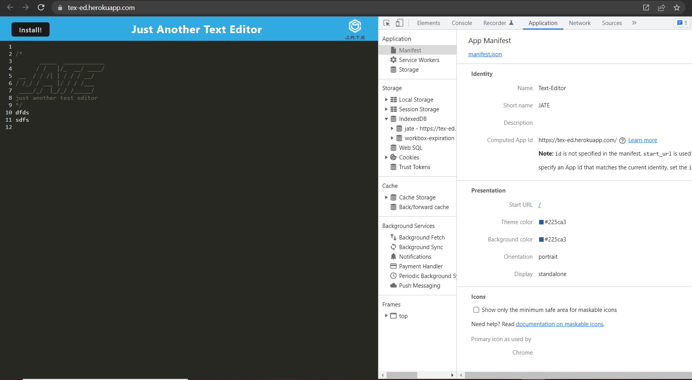
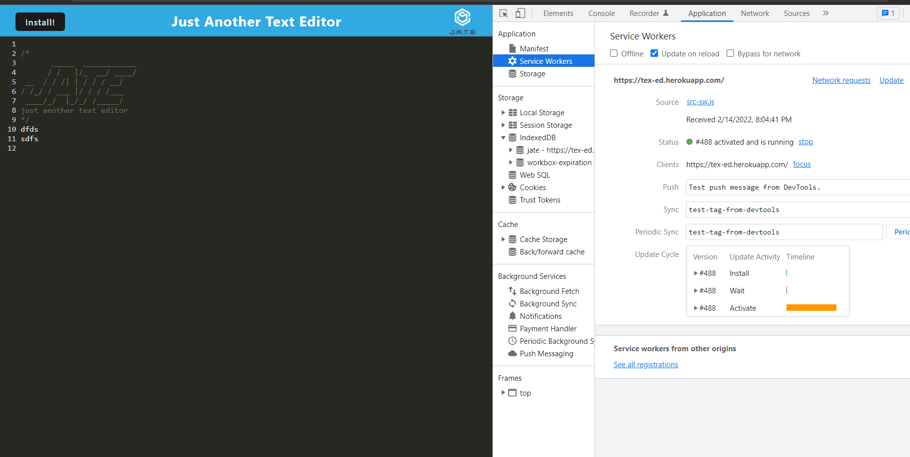
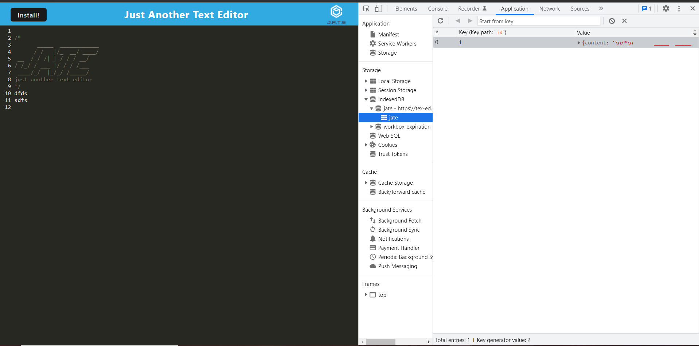
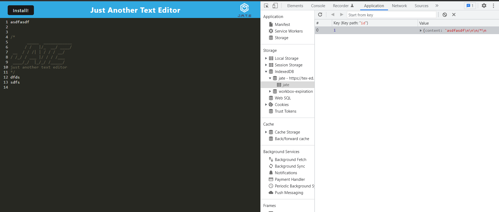
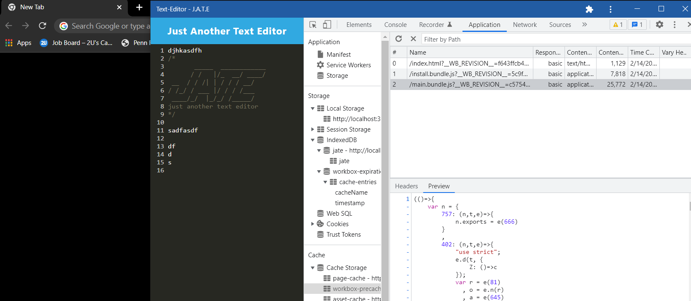

# textEd

## Description

The goal was to create a progrssive web application to write code or text with or without internet connection. The application is able to be installed to a computer locally and continue to function without internet. This is done by using local storage for storage without internet and indexedDB with internet. Workbox and webpack plugins are used to create a service worker that stores the data on a web browser database and bundle the files together. During this project, I learned to work with both local and client-side web browser storgage for a PWA.

## Table of Contents (Optional)
- [Installation](#installation)
- [Usage](#usage)
- [Credits](#credits)
- [License](#license)
- [Features](#features)

## Installation

## Usage
Here are links to the deployed Text Editor App and GitHub repo. [text editor deployed link](https://tex-ed.herokuapp.com/) [GitHub Repo](https://github.com/MaxStump13/textEd)

When the page is loaded, the applpication will appear as seen below. 

Below is the service worker's active status. At load up, an indexedDB database is created for the browser. 

Once the user types something and unfocuses the editor, the current text is saved locally and in the indexedDB storage.
.

Clicking on the install button will install the application to the users desktop. The view is very similiar and can be used with or without internet.

## Credits
1. [MDN](https://developer.mozilla.org/en-US/)
2. [Geeksforgeeks](https://www.geeksforgeeks.org/)
3. [Medium](https://medium.com/covenant-university-developers-community/what-are-pwas-build-one-in-15-minutes-124cad2d32cb)
4. [npm](https://www.npmjs.com/package/webpack-dev-server)
5. [Workbox](https://developers.google.com/web/tools/workbox/guides/generate-service-worker/webpack)
6. [webpack](https://webpack.js.org/guides/asset-management/)
7. [W3](https://www.w3schools.com/)
8. [Stackoverflow](https://stackoverflow.com/)
9. [Morioh](https://morioh.com/p/238e7788fcc8)

## License
[License](./LICENSE)

## Badges
N/A

## Features
1. Installable PWA text editor
2. Stores data locally and with browser database
3. Updates storage when editor is unfocused

## How to Contribute
If there are any suggestions to improve this generator, this is my [GitHub](https://github.com/MaxStump13) account. 
